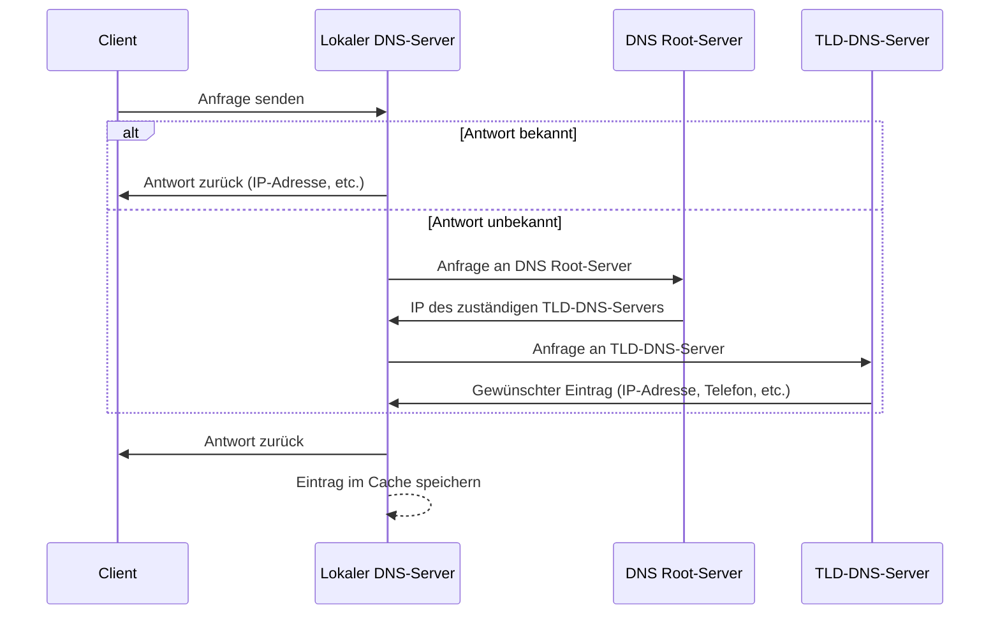

Es ist ein verteiltes hierarchisches System zum Auflösen von
Namen in [[IP-Adress]]. Dadurch kann man Rechner und Dienste über eine Domain wie Server.lan anstatt über [[IP-Adress|IP-Adressen]] ansprechen. Dadurch können auch mehrere Dienste über eine [[IP-Adress|IP-Adresse]] angesprochen werden. Die Informationen zu den Namen werden hierarchisch auf Server aufgeteilt.

### use Cases

- **Auflösung von IP-Adressen**:  
    Übersetzung von Domain-Namen (z. B. `example.com`) in IP-Adressen (z. B. `192.168.0.1`) und umgekehrt.
    
- **E-Mail-Austausch (MX-Einträge)**:  
    Bestimmung des Mailservers einer Domain für die Zustellung von E-Mails.
    
- **Veröffentlichung von öffentlichen Schlüsseln (TXT-Einträge)**:  
    Bereitstellung von Schlüsseln für die Authentifizierung von Mailservern (z. B. SPF, DKIM, DMARC).
    
- **Telefonnummernauflösung auf SIP-URIs (ENUM)**:  
	Umsetzung von Telefonnummern in SIP-URIs über `e164.arpa` (selten genutzt).

---
## Vorteile
- [[IP-Adress|Ip-Addressen]] können geändert werden ohne Domain ändern
- Domain leichter zu merken als IP
- Load-Balancing kann auf [[Domain Name System|DNS]] Level Passieren
- Meta Daten können definiert werden
---
## Struktur
![[Drawing 2024-12-06 13.10.45.excalidraw|1000]]

### Top Level
Die Top Level Domains werden einem Land bzw. einer Region zugeordnet.
 - .at Österreich
- .ca Canada

Organisatorische Top Level Domains

- .com Komerzielle unternehmen
- .edu Bildungseinrichtungen
- .org Nicht kommerzielle Organisationen, z.B. Wikipedia
-  .net Netzwerkeinrichtungen, z.B. RIPE
- Int Internationale Organisationen
- .gov Staatliche Institution
- .mil Militärische Einrichtungen

Es können bei der [[Standart Organasitations|IANA]] auch Top Level Domains beantragt werden. Dies kann von Regionen, z.B.
Tirol (.tirol), aber auch von Firmen z.B. Ferero (.kinder) gemacht werden

---
## Namesauflösung



#### Reverse DNS
<small>
Es gibt die Möglichkeit eine IP Adresse in einen DNS Namen zurück aufzulösen. Dazu wird der
Bereich in-addr.apra verwendet. Z.B. 1.1.1.1.in-addr.arpa Die IP wird dazu in
umgekehrter Reihenfolge bei in-addr.arpa angehängt. Dann wird als Antwort der PTR Eintrag
geliefert, welcher die dazugehörige Domain liefert.
</small>

---
## DNS Server
Es wird dabei in den Primary Server und Slave Server unterschieden. Der Slave Server kann die Aufgabe des Primary Servers übernehmen und synchronisiert sich mit dem Primary Server. Der Slave Server kann zum Lastausgleich und zur Redundanz genutzt werden.

Meistens wird im Netzwerk ein DNS Server eingesetzt, welcher gleichzeitig ein DNS Resolver ist oder die Anfragen an einen DNS Resolver weiterleiten kann, wenn die Top Level Domain nicht im Zuständigkeitsbereich des Servers liegt. Dieser Server kann die Anfrage für die interne Domain Lokal auflösen. In vielen Fällen ist dieser mit dem DHCP Dienst gekoppelt, damit den Dynamischen IP Adressen im Netzwerk die passenden DNS und rDNS Einträge verpasst werden können. Dies ist WLAN fähigen Geräten, wie Laptops extrem nützlich.
Zwischen DNS Server kommt zum Zonen Abgleich meistens [[TCP]] zum Einsatz, wobei [[UDP]] auch möglich ist.

---
## DNS Einträge
Zonen Eintrag vom Bind:
```
@   IN  SOA dns.foxplex.local. mail.foxplex.local. (
        1       ; Serial
        604800  ; Refresh
        86400   ; Retry
        2419200 ; Expire
        86400   ; Negative Cache TTL
    )

; Nameserver
@   IN  NS  dns.foxplex.local.

; Mailserver
@   IN  MX  10 mail.foxplex.local.

; A-Records
dns         IN  A   192.168.1.1
mail        IN  A   192.168.1.2
client1     IN  A   192.168.1.10
client2     IN  A   192.168.1.11

```

- **@**  
    Platzhalter für die Domain, für welche die Zonendatei zuständig ist.
    
- **SOA (Start of Authority)**  
    Enthält grundlegende Informationen über die Zone:
    
    - Zuständiger Server und E-Mail-Adresse des Administrators (erster Punkt durch „@“ ersetzt).
    - **Serial**: Seriennummer des Eintrags.
    - **Refresh**: Gültigkeitsdauer der Informationen.
    - **Retry**: Intervall für Wiederholungsversuche bei Fehlern.
    - **Expire**: Zeit, nach der der Eintrag ungültig wird, wenn der Server ausfällt.
    - **Negative Cache TTL**: Dauer der Gültigkeit einer "keine Domain gefunden"-Meldung.
- **A**  
    IPv4-Adresse, die einer Domain zugeordnet ist.
    
- **AAAA**  
    IPv6-Adresse, die einer Domain zugeordnet ist.
    
- **NS (Name Server)**  
    Gibt den autoritativen Nameserver der Domain an. Er muss durch einen passenden A-Eintrag ergänzt werden.
    
- **MX (Mail Exchange)**  
    Bestimmt den Mailserver für eingehende E-Mails. Auch hier muss ein passender A-Eintrag existieren.
    
- **CNAME (Canonical Name)**  
    Aliasname oder "Spitzname" für eine Domain.
    
- **TXT (Text)**  
    Enthält Texteinträge, z. B. für Mail-Konfiguration (SPF, DKIM) oder ENUM.
    
- **LOC (Location)**  
    Gibt die geografische Position der Domain an.
    
- **NAPTR (Naming Authority Pointer)**  
    Liefert Adressen von Servern sowie zusätzliche Informationen wie Dienste und URIs.
    
- **RP (Responsible Person)**  
    Gibt die verantwortliche Person für die Domain an.

---
### [[DNS Sec]]

--- 
## DOH / DOT
DOH steht für DNS über HTTPS. Dabei wird eine HTTPS Verbindung zwischen Client und DNS Resolver. Dadurch ist die Integrität, Vertraulichkeit und Authentizität zwischen DNS Resolver und Client gewährleistet. Bei den meisten Firewall Systemen scheint eine solche DNS Abfrage nicht als DNS Abfrage auf und kommt dadurch leichter durch Firewalls durch.

DOT steht für DNS over TLS. Dabei wird die DNS Anfrage mittels TLS verschlüsselt übertragen. Dadurch ist die Integrität, Vertraulichkeit und Authentizität zwischen DNS Resolver und Client gewährleistet . Dabei wird der Port 853 verwendet.