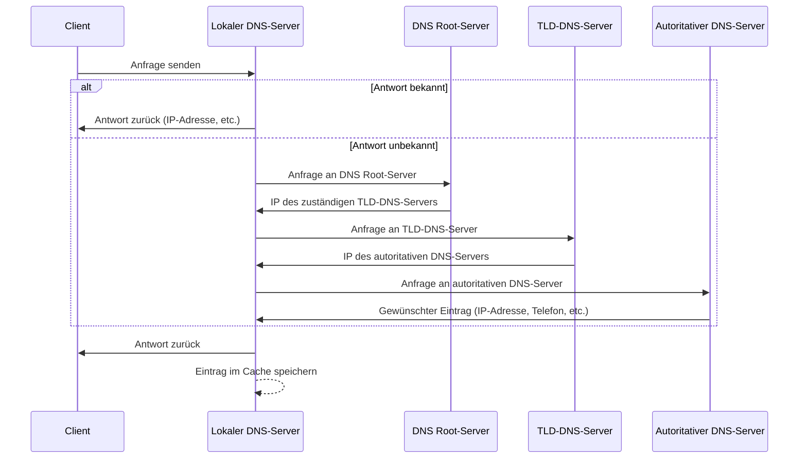

Es ist ein verteiltes hierarchisches System zum Auflösen von
Namen in IP-Adressen. Dadurch kann man Rechner und Dienste über eine Domain wie Server.lan anstatt über IP Adressen ansprechen. Dadurch können auch mehrere Dienste über eine IP Adresse angesprochen werden. Die Informationen zu den Namen werden hierarchisch auf Server aufgeteilt.

## Vorteile
- Ip Addressen können geändert werden ohne Domain ändern
- Domain leichter zu merken als IP
- Load-Balancing kann auf [[Domain Name System|DNS]] Level Passieren
- Meta Daten können definiert werden

## Struktur
![[Drawing 2024-12-06 13.10.45.excalidraw|1000]]

### Top Level
Die Top Level Domains werden einem Land bzw. einer Region zugeordnet.
 - .at Österreich
- .ca Canada

Organisatorische Top Level Domains

- .com Komerzielle unternehmen
- .edu Bildungseinrichtungen
- .org Nicht kommerzielle Organisationen, z.B. Wikipedia
-  .net Netzwerkeinrichtungen, z.B. RIPE
- Int Internationale Organisationen
- .gov Staatliche Institution
- .mil Militärische Einrichtungen

Es können bei der IANA auch Top Level Domains beantragt werden. Dies kann von Regionen, z.B.
Tirol (.tirol), aber auch von Firmen z.B. Ferero (.kinder) gemacht werden

